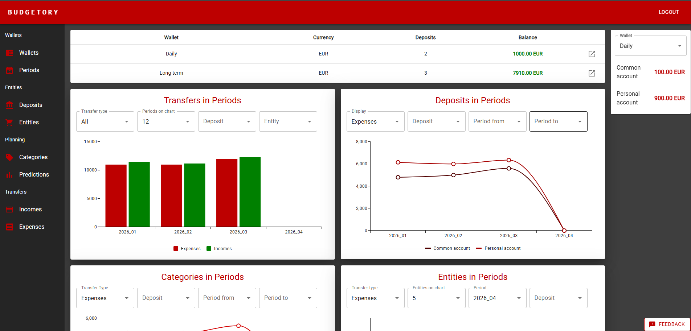
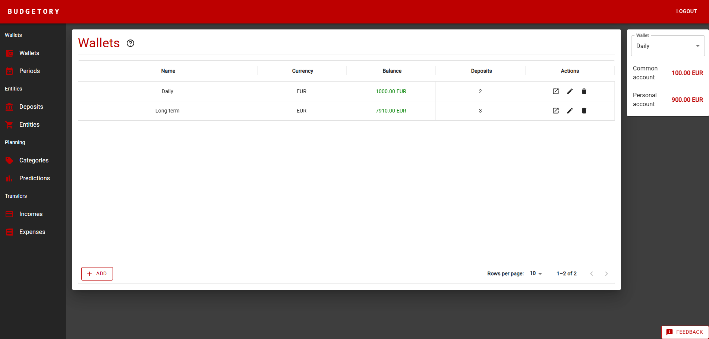
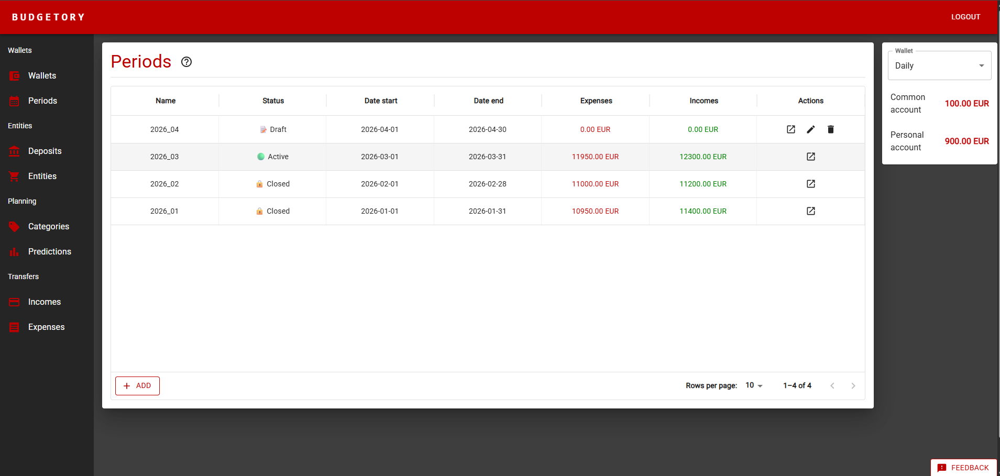
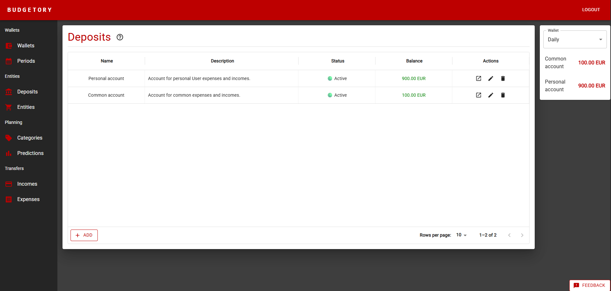
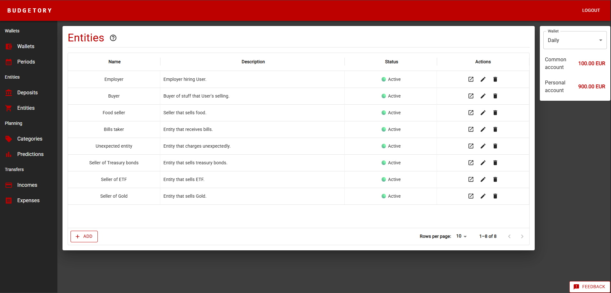
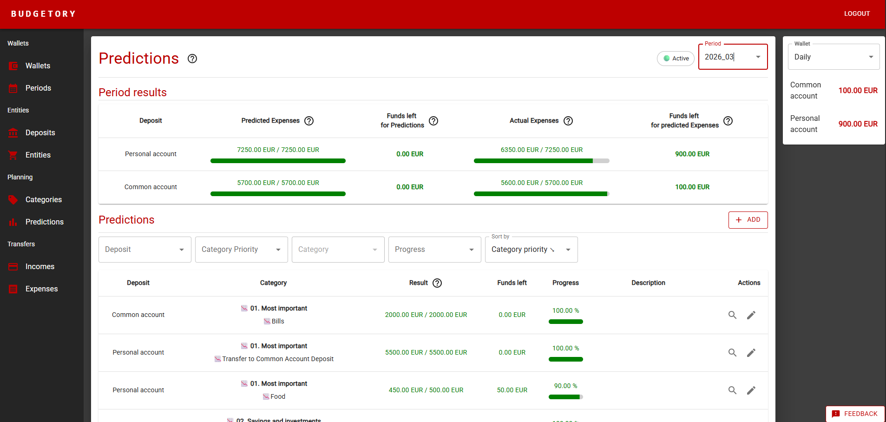
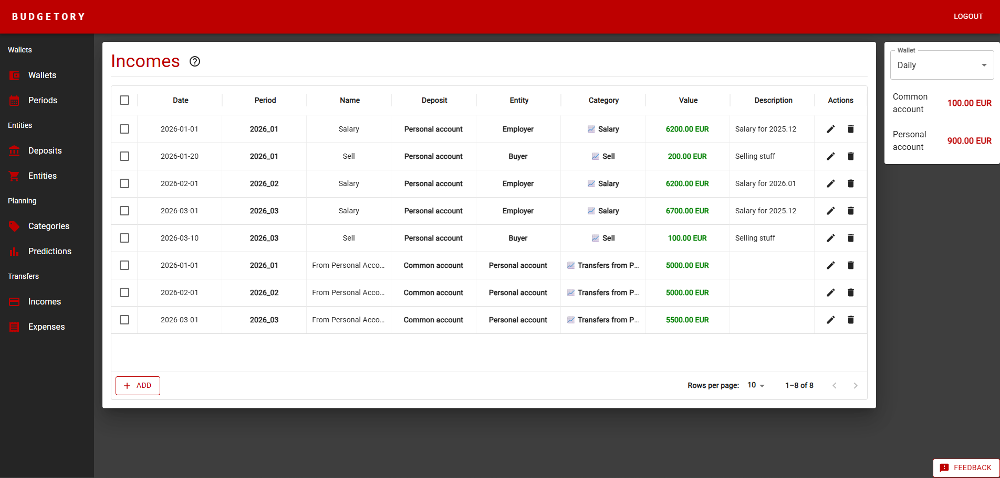
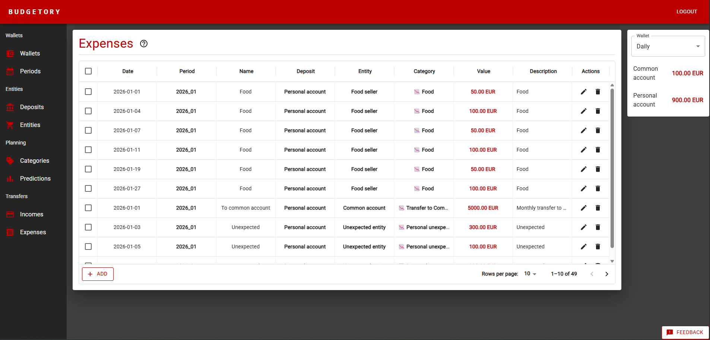

# Budgetory App


FullStack personal finance management application consisting of a Django REST Framework API, PostgreSQL database, and React frontend client.

---

## Tech Stack

### Backend

| Category | Technology |
|:---|:---|
| **Language** | Python 3.12 |
| **Framework** | Django + Django REST Framework |
| **Dependency Management** | Poetry |
| **Database** | PostgreSQL |
| **Configuration** | Dynaconf |
| **Code Quality** | Pre-commit hooks, Flake8 |
| **Containerisation** | Docker + Docker Compose |
| **CI/CD** | GitHub Actions |

### Frontend

| Category | Technology |
|:---|:---|
| **Language** | JavaScript |
| **Framework** | React (Create React App) |
| **Package Manager** | Yarn |
| **Linting** | ESLint |
| **Containerisation** | Docker |
| **CI/CD** | GitHub Actions |

---

## Features

### 🔐 User Authentication

Token-based authentication system ensuring secure access to the API. Each user's data is fully isolated — wallets, periods, deposits, categories, and transfers are scoped to the authenticated user. Supports registration, login, logout, and demo login.

---

### 📊 Landing Page with Dashboard

Users are greeted with a dashboard providing a high-level overview of their financial situation — summarising total income and expenses for the current period, deposit balances, and progress against expense predictions.

The API powers this with computed endpoints that aggregate financial data in real time, calculating key metrics across wallets and periods.



---

### 👛 Wallets

Wallets organise multiple deposits under a common purpose — for example, a daily wallet and a long-term savings wallet — each with its own periods, deposits, and transfer history.

The API supports full CRUD operations with user-scoped isolation, ensuring wallets and their related data remain private to each user.



---

### 📅 Periods

Users define distinct time ranges (e.g. monthly or custom date ranges) to organise their finances. Each period acts as a container for all incomes, expenses, and predictions recorded within it.

The API enforces that periods cannot overlap within the same wallet and handles cascading deletion of related data.



---

### 💳 Deposits

Users track multiple deposit accounts, each holding a balance that updates automatically as transfers are recorded — giving a real-time view of funds across all accounts.

Deposit balances are automatically calculated from linked transfers and support filtering by wallet and period.



---

### 🏢 Entities

Entities represent external parties involved in transactions — such as employers, shops, service providers, or individuals. They can be associated with income or expense transfers to track the flow of money.

The API includes validation to prevent deletion of entities referenced by existing transfers, preserving data integrity.



---

### 🏷️ Categories

Income and expense transfers are assigned to categories, giving a clear breakdown of where money is coming from and going to. Categories can be created and tailored to personal spending habits.

Each category has a type (`income` or `expense`) and cannot be deleted if referenced by existing transfers.


---

### 🔮 Expense Predictions

Users set predicted spending amounts for expense categories within a period, then track actual expenses against those predictions as the period progresses.

Predictions are unique per category per period. The API provides comparison endpoints for budget adherence monitoring.



---

### 💰 Incomes

Users log individual income transfers, assigning each to a category, deposit, period, and optionally a source entity. The full history of received funds is available and filterable by period, with deposit balances updated automatically.



---

### 💸 Expenses

Users log individual expense transfers, assigning each to a category, deposit, period, and optionally a target entity. The full history of outgoing payments is filterable by period and can be compared against predictions to track budget adherence.



---

## Local setup

### Prerequisites

- [Docker](https://www.docker.com/) and Docker Compose
- [Node.js](https://nodejs.org/) (for local frontend development)
- [Python 3.12](https://www.python.org/) (for local backend development)

### Running with Docker Compose

```bash
# Clone the repository
git clone https://github.com/MateDawid/BudgetoryApp.git
cd BudgetoryApp
# Prepare .env files for both services
cp backend/.env_docker backend/.env
cp frontend/.env_example frontend/.env

# Build services
docker compose build

# Run app with frontend instant reload on changes
docker compose up --watch

# Run app casually
docker compose up -d 
```

The API will be available at `http://localhost:8000` and the frontend at `http://localhost:3000`.

### Running Locally

**Backend:**
```bash
cd backend
# Create and activate virtual env
py -3.12 -m venv venv
.\venv\Scripts\activate
# Verify Python version - has to be 3.12.?
python --version
# Install pip, setuptools and poetry
python -m pip install -U pip setuptools
python -m pip install poetry
# Install app dependencies with poetry
poetry install
# Run database service
docker compose up -d db
# Copy .env_local content and create .env file with it
cp .env_local .env
# Run database migrations
poetry run python .\src\manage.py migrate
# Run API service
poetry run python .\src\manage.py runserver
```

**Frontend:**
```bash
# Install yarn
npm install --global yarn
# Install app dependencies
cd frontend
yarn install
# Copy .env_example content and create .env file with it
cp .env_example .env
# Run frontend service
yarn start
```

The API will be available at `http://localhost:8000` and the frontend at `http://localhost:3000`.

---


## Author

**Dawid Mateusiak** — [@MateDawid](https://github.com/MateDawid)